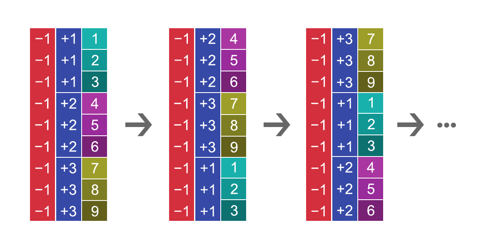

% Permutation Inference for the GLM
## General Liner Model notation ##

Before exploring the permutation strategies appliable to GLM, it's important to give a proper notation.

At each spatial point (voxel or vertex) of an image representation of the brain, a *general linear model* can be formulated and expressed as:

$Y = M\phi + \epsilon$

where:

- $Y$ is the $N x 1$ vector of observed data.
- $M$ is the full rank $N x r$ design matrix that includes all effects of interest as well as modelled nuisance effects.
- $\phi$ is the $r x 1$ vector of $r$ regression coefficients.
- $\epsilon$ is the $N x 1$ vector of random errors.

Estimates for the regression coefficients can be computed as $\phi_{est.} = M^+Y$, where the superscript ($^+$) denotes the Moore-Penrose pseudo-inverse. Our interest is to test the null hypothesis that an arbitraty combination (contrast) of some or all of these parameters is equal to zero, that is

$H_0 : C'\phi = 0$

where $C$ is a $r x s$ full-rank matrix of $s$ contrasts, 1 $\leq s \leq r$.

## Permutagion strategies ##

The most important aspect of permutation tests is the manner in which data are shuffled under the null hypothesis. It is the null hypothesis, together with assumptions about exchangeability, which determines the permutation strategy.

Let the $j$-th permutation be expresssed by $P_j$, a $NxN$ permutation matrix, a matrix that has all elements being either 0 or 1, each row and column having exactly one 1. Pre-multiplication of a matrix by $P_j$ permutes its rows. We smilarly define a sign flipping $S_j$, a $NxN$ diagonal matrix whose non-zero elements consist only of $+1$ or $-1$. Pre-multiplication of a matrix by $S_j$ implements a set of sign flips for each row.  The essential assumption of permutation methods is that, for a given set of variable, *their joint probability distribution does not change if they are rearranged*. This can be expressed in terms of **Exchangeable Errors (EE)** and/or **Independent and Symmetric Errors (ISE)**, each of these weakining different assumptions when compared to parametric methods.

**Exchangeable Errors** is the traditional permutation requirement. The formal statement is that, for any permutation $P_j$, 

$\epsilon \text{*=} P_j\epsilon$

Where $\text{*=}$ denotes equality of distributions. Exchangeability is similar to, yet more genreal than, independence, as exchangeable errors can have all-equale and homogeneous dependence. Relative to the common parametric assumptions of independent, normally and identically distributed (iid) errors, EE relaxes two aspects:

1. Normality is no longer assumed, although identical distributions are required.
2. The independence assumption is weakened slightly to allow exchangeability when the observations are not independent, but their joint distribution is maintained after permutation.

**Independent and Symmetric Errors** can be considenred for measurements that arise, for instance, from difference between two groups if the variances are not assumed to be the same. The formal statement for permutation under ISE is that for any sign flipping matrix $S_j$ we have:

$\epsilon \text{*=} S_j\epsilon$

Relative to the parametric assumptions of errors iid, ISE realxes normality, although symmetry (i.e. non-skewness) of distributions is required. Independence is also required to allow sign flipping of one observation without perturbing the others.

The choice between EE and ISE depends on the knowledge/assumptions about the error terms. If both EE and ISE are plausible and available for a given model, they can be performed together, increasing the number of possible rearrangements.

## Exchangeability blocks ##
The experimental design may dictate blocks of observations that are jointly exchangeable, allowing data to be permuted *Within Block* or, alternatively, that the blocks may themselves be exchangeable as a whole. This is the case, for instance, for designs that involve multiple observations from each subject. While permutation methods genereally do noe easily deal with non-independent data, the definition of these **Exchangeability Blocks(EBS)** allows these special cases of well structured dependence to be accomodated. Even though the EBS determine how the data shuffling are performed, they should not be confused with **Variance Groups (VG)**, i.e. groups of observations that are known or assumed to have similar variances, whica can be pooled for estimation and computation of the statistic. Variance groups need to be compatible with the exchangeability blocks. Formally speaking, if $V$ is a vector of $Nx1$ variance group labels, then the following equality must hold:

$P_jV = V$

For each permutation matrix $P_j$ coherent with the block structure.

### Exchangeability Tree ###

One way to define such blocks in a hierarchical fashion is that of using an **Exchangeability Tree(ET)**. In such a tree, the $N$ leaves represent the actual observations, and each node in the middle layers defines a block. The block defined by a node is simply the set of its sons. A boolean value associated to each node gives us the information about the exchangeability of that block. This structure lets us to specify many layers as we like, although for simple designs three layers usually are more than sufficient. 

Another useful feature of the ET is that it's easily represantable as a matrix. The matrix features one row for leaf and one column for each layer of the tree. The minimum number of layers required is 2, corrisponding to the root and the observations. The first layer should always be either a column of "+1" or a column of "-1". Each layer specifies the exchangeability of the next layer. This is done by using two elements:

1. Numbers. Each number denotes a different exchangeability group.
2. Sign. A + sign denotes that a group can be permutated. A - sign denotes that a group cannot be permutated.

#### Example 1: Unrestricted exchangeability ####

This is the simplest example of ET. In this case, also known as unrestricted exchangeability, all the observations belong to the same group (1) and are exchangeable with each other(+).

#### Example 2: Whole block exchangeability ####

In this case, there are three groups that can be permutated as blocks, but they are not permutable internally.

#### Example 3: Within block exchangeability ####

In this case, there are three groups that can be permutated internally, but they are not permutable as blocks.
