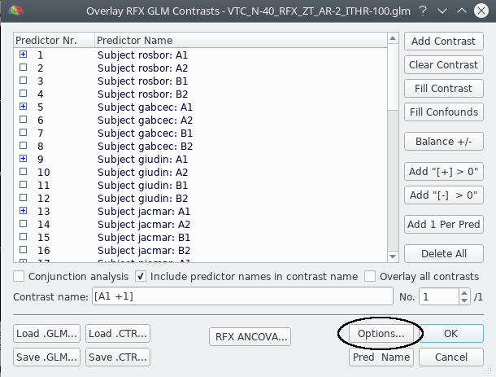
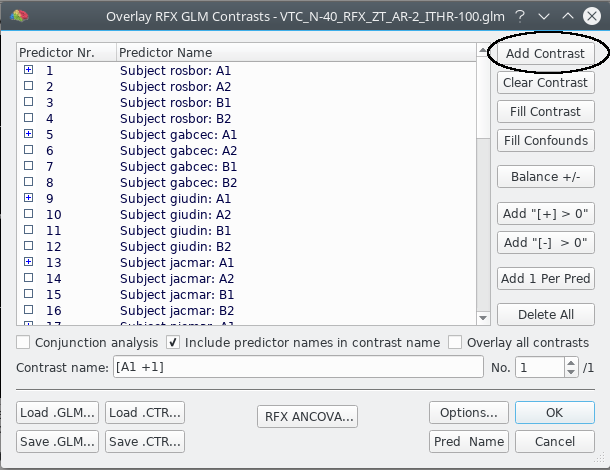

%Randomise Plugin Help
## Overview ##
This plugin performs permutation tests and inference on multy subject task related fMRI experiments. It has to be executed after GLM multy study analysis. For further details about permutation testing and its use on with the General Linear Model, refer to the following pages:

- [Permutation testing](PermutationTesting.html)
- [Permutation testing applied to GLM](PermutationTestingGlm.html)
- [Threshold Free Cluster Enhancement](Tfce.html)

## Before running the plugin ##
The plugin needs the beta maps of the contrast of interest for each subject. Depending on the type of study, e.g. a paired t-test, there can also be more than one map for each subject. The beta maps can be easily generated using the "Overlay General Linear Model dialog", as shown below.

### Example: creating maps for one sample t-test ###
First of all, we have to load the .vmr file related to the study. Then, we can load our .glm file from the Analysis -> Overlay General Linear Model and select the contrast of interest. In the example, we want to study the group activation of the condition A1. After the contrast has been set, we move to the options menu to create the beta maps.

In the dialog, be sure to select "Create beta/contrast maps" and "Create separate maps for each subject", then click "Create maps".

You can view the created maps in Analysis -> Overlay Volume Maps.

### Example: creating maps for paired t-test ###
This example is very similar to the previous one, except for the fact that more than one contrast is specified. In this case, we want to confront conditions A1 and B1. We first specify A1 as previously done, than we add the new contrast regarding B1:

We create the beta maps in the same way as we did before, and here's the result:

## GUI description ##
After the creation of the beta maps, the plugin GUI can be launched from the Plugins menu. Note that the creation of the beta maps is essential, otherwise the GUI won't load at all.

As you can see from the image, the GUI is divided into two main parts: **Design** and **Options**. A brief description of each component is provided below.

### Type of study ###
This combobox lets the user select the type of analysis he wants to perform. The default selection is "Custom", which means that the user must specify himself the design matrix, the contrast and the exchangeability tree using the buttons above each matrix and then fill the entries manually. If one of the other predefined studies is selected, then all the matrices and the options will be filled automatically. In this case, the buttons and the options will also be disabled, as shown in the example above.

### Design Matrix ###
The design matrix features one row for each beta map and one column for each regressor. Since the number of maps remains the same through the execution of the plugin, the user doesn't need to specify the number of rows as it is set automatically. As a result of this, the buttons above the matrix add and remove columns/regressors from it.

### Contrast Matrix ###
The contrast matrix features one column for each regressor specified in the design matrix and one row for each contrast specified by the user. In this case, since the number of regressors is set up in the design matrix, the buttons above the matrix add or remove rows/contrasts from it.

### F-Test matrix ###
The F-Test matrix is used in those designs in which F-Tests are involved. It features one row for each contrast and one column for each F-tests. The buttons above the matrix add or remove columns/f-tests. The entry at row i, column j of this matrix specifies if the contrast i must be taken into account when composing f-test j.

### Options and TFCE ###
The options tab is pretty much self explainatory. For any doubts about exchangeability hypothesis and TFCE, refer to the pages linked above.

### Number of permutation requested ###
The number of permutation can be speficied by the user by modifying the value in the relative spin box. However, it should be noted that the number specified by the user aren't always the actual permutation performed by the plugin, but it can be thought as an upper bound. 

During the execution of the plugin, each contrast is treated separately. For one specific contrast, the maximum number of permutations depends on the design matrix, on the exchangeability tree and the hypothesis about the errors. After the maximum number of permutations is computed, it is confrontated with the number supplied by the user. If the number supplied by the user is inferior, than only that number of permutations will be performed. 

## Tips & Tricks ##

### Which type of standard analysis should I run? ###
The choice of analysis to performs depends on what are you searching in your study:

- If you're looking for group effects, perform *One sample t test*.
- If your study involves patients and controls, and error variance can be assumed to be the same across all subjects, perform *Two sample unpaired t test*.
- If you want to confront a pair of different conditions over the same subjects, perform *Two sample paired t test*. (And be sure to have generated the maps properly.) 

### Modify a standard analysis ###
There are several reasons to modify one of the standard analysis listed in the plugin:

1. You may want to add additional covariate (e.g. age, sex, handdeness) to the study.
2. The study doesn't suit your needs. For example, the two sample unpaired t test assumes that first half of your maps belong to the first sample, and the second half to the second sample, but that's not always the case.
3. You may want to build a custom study starting from one standard analysis.

The plugin gives you the chance to modify arbitrarily one of the standard analysis. To do so, first select a study different from "Custom". After the tables and the options are filled automatically, reselect "Custom". You'll notice that the setup remains the same, but now all the control buttons are enabled.

Now you can add regressors, layers to the exchangeability tree, ftests and contrasts. You can also change the hypothesis and the statistics used by the test.

### Choice of the statistic for custom analysis ###
The plugin offers three statistics:

- T statistic.
- F statistic.
- G statistic.

You won't probably know the last one, since it's not a real statistic but a generalization of known statistics (including F and T as well):

|                                                               |        rank(C) = 1       |  rank(C) > 1  |
|---------------------------------------------------------------|:------------------------:|:-------------:|
|       Homoscedastic errors, unrestriced exchangeability       |        Square of T       |    F-ratio    |
| Homoscedastic errors within group, restricted exchangeability | Square of  Aspin-Welch v | Welch's $v^2$ |

So, when setting up a custom analysis, the G statistic is probably your safest choice. However, it should be noted that since G statistic has a very complex equation involving lots of matrix products and so its computation degrades overall performance. So, use it should only be used when it's strictly necessary.

## Computing & Visualizing results ##

After you've set up your study, click on the OK button on the bottom right of the GUI to start the computation. This will take a while, depending on the number of contrasts specified, the use of TFCE and the choice of the statistic. You can monitor the progress in the Log bar of BrainVoyager, which is updated every time interval specified in the GUI.

Once the plugin has finished, you can view the results in Analysis -> Overlay Volume Maps.

As you can see, for each contrast three map are generated:

1. A map of the statistic of your choice computed for that contrast.
2. A map of 1-p uncorrected p-values.
3. A map of 1-p FWER corrected p-values.

Remember to save the results, especially if they're produced after a long time, as the plugins doesn't do it automatically.

## Authors ##
Algorithm: Anderson M. Winkler, Gerard R. Ridgway, Matthew A. Webster, Stephen M. Smith, Thomas E. Nichols.

Implementation: Marco Mecchia
