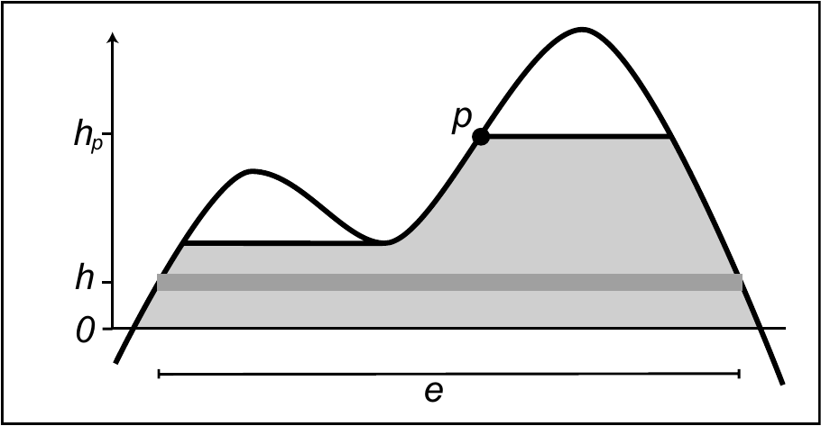

% Threshold Free Cluster Enhancement

**Threshold Free Cluster Enhancement (TFCE)** is a method for finding "clusters" in the data without having to define clusters in a binary way (e.g. with a cluster threshold). The TFCE approach aims to enhance areas of signal that exhibit some spatial contiguity. The image is passed through an algorithm which enhances the intensity within cluster-like regions more than background (noise) regions. The output image is therefore not *intrinsically* thresholded/clustered.

The TFCE algorithm is illustrated in the figure above. The solid curve shows a 1D profile through and example statistic image (e.g. an unthresholded t statistic image). Each voxel's TFCE score is given by the sum of the scores of all "supporting sections" underneath it; as the height $h$ is incrementally raised from zero up to the height (signal intensity) $h_p$ of a given point $p$, the image is thresholded at $h$, and the single contiguous cluster containing $p$ is used to define the score for that height $h$. This score is simply the height $h$ (raised to some power $H$) multiplied by the cluster extent $e$ (raised to some power $E$). Precisely, the TFCE output at voxel $p$ is

where $h_0$ will typically be zero, and $E$ and $H$, 0.5 and 2 respectively. In practice this integral is estimated as a sum, using finite $dh$.

It is important to note that this kind of statistics can only be used with a permutation framework. Indeed, without a permutation framework, there's no way to obtaine p-values, either uncorrected or corrected, from a cluster-enhanced output image, since there's no standard distribution to refer to.
